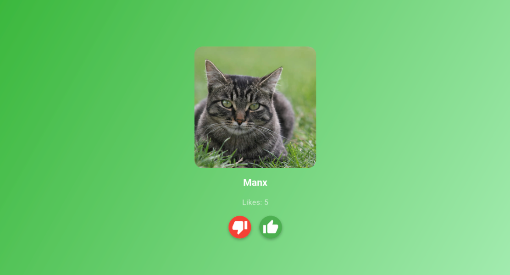
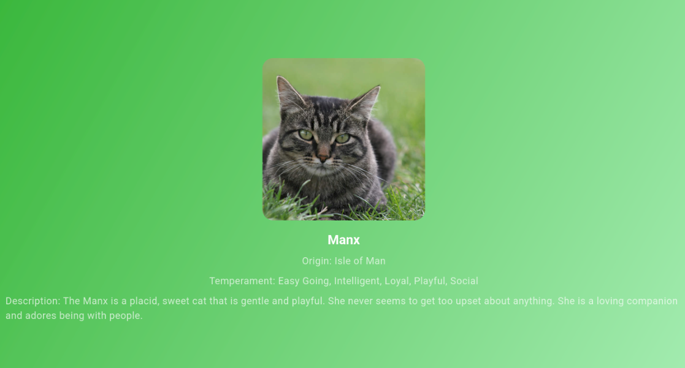
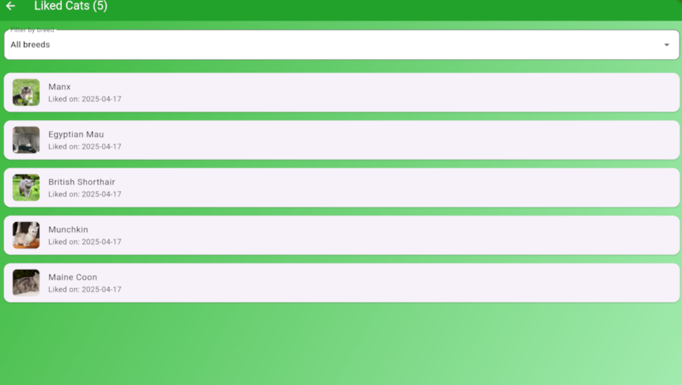

# Kototinder PRO

Приложение для просмотра случайных изображений котиков и информации об их породах. Пользователь может "лайкать" или "дизлайкать" изображения, открывать страницу с лайкнутыми котиками, а также просматривать детальную информацию о породе котика.

---

## Описание проекта

Kototinder PRO — это простое и удобное приложение для любителей котиков. Оно использует [The Cat API](https://thecatapi.com/) для получения случайных изображений кошек и информации об их породах. Пользователь может:
- Просматривать случайные изображения котиков.
- Узнавать название породы, описание, темперамент и происхождение.
- "Лайкать" или "дизлайкать" изображения.
- Открывать экран с детальной информацией о породе.
- Открывать страницу с лайкнутыми котиками
- В структуре проекта реализована четкая декомпозиция на слои: Data, Domain, Presentation

---

## Реализованные фичи

- **Случайные изображения котиков**: На главном экране отображается случайное изображение котика и название его породы.
- **Свайпы и кнопки**: Пользователь может свайпнуть изображение влево (дизлайк) или вправо (лайк), а также использовать кнопки для лайка и дизлайка.
- **Счетчик лайков**: При лайке изображения счетчик увеличивается.
- **Детальный экран**: При нажатии на изображение открывается экран с детальной информацией о породе котика.
- **Анимация свайпов**: При свайпе изображение плавно смещается в сторону.
- **Список лайкнутых котиков** с:
  - Фото и названием породы
  - Датой добавления
  - Фильтрацией по породам
- **Удаление котика из лайкнутых**:
  - Свайп влево для удаления
- **Оффлайн-доступ**: Можно использовать приложение даже без сети.
- **Сохранение истории**: Лайки/дизлайки сохраняются между выходами из приложения.

---

## Скриншоты интерфейса

### Главный экран


### Экран с деталями


### Экран лайкнутых котиков


---

## Установка и запуск

1. Клонируйте репозиторий:

   ```git clone https://github.com/svyatsharik/Kototinder_Offline.git```

2. Перейдите в папку проекта:

   ```cd Kototinder_Offline```

3. Установите зависимости:

   ```flutter pub get```

4. Сгенерируйте код:

   ```flutter pub run build_runner build --delete-conflicting-outputs```

5. Запустите приложение:

   ```flutter run```

---

## Используемые технологии

- **Flutter**: Фреймворк для создания кроссплатформенных приложений.
- **The Cat API**: API для получения изображений и информации о котиках.
- **BLoC**: Управление состоянием приложения
- **CachedNetworkImage**: Кэширование изображений
- **Dio**: HTTP-клиент для сетевых запросов
- **Intl**: Форматирование дат
- **GetIt**: Dependency Injection
- **Drift**: Локальная SQLite база данных
- **ConnectivityPlus**: Мониторинг сетевого подключения
